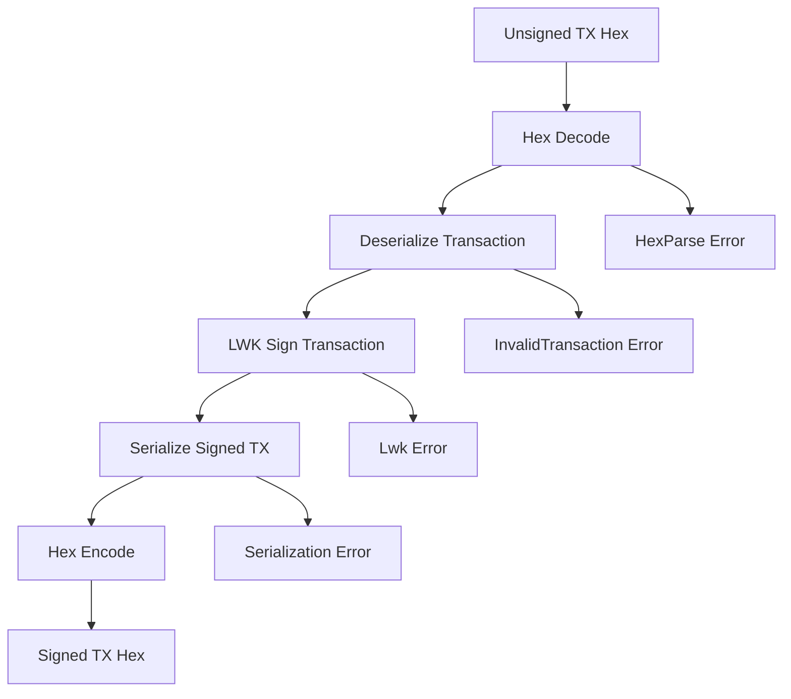

# Design Document

## Overview

The LwkSoftwareSigner implementation provides a testnet-focused transaction signing capability for the amp-rust crate using Blockstream's Liquid Wallet Kit (LWK). This design integrates LWK's SwSigner for in-memory private key management with a clean async interface that supports the existing amp-rust architecture patterns.

The signer will be implemented as a new module within the existing crate structure, following established patterns for error handling, async operations, and testing. It will serve as the foundation for asset operation functions (reissue_asset, distribute_asset, burn_asset) that require transaction signing capabilities.

## Architecture

### Module Structure

```
src/
├── lib.rs              # Updated to export signer module
├── client.rs           # Existing API client
├── model.rs            # Existing data models
├── mocks.rs            # Existing mocks
└── signer.rs           # New signer module
    ├── mod.rs          # Module exports and trait definition
    ├── lwk.rs          # LwkSoftwareSigner implementation
    └── error.rs        # Signer-specific error types
```

### Dependency Integration

The implementation will add the following dependencies to Cargo.toml:

```toml
[dependencies]
# Existing dependencies...
lwk_signer = "0.5"
lwk_common = "0.5"
bip39 = "2.0"
elements = "0.22"
hex = "0.4"
# async-trait, thiserror, tokio, tracing already present
```

### Core Trait Design

```rust
#[async_trait]
pub trait Signer: Send + Sync {
    async fn sign_transaction(&self, unsigned_tx: &str) -> Result<String, SignerError>;
}
```

This trait provides a clean abstraction that allows for future signer implementations (hardware wallets, remote signers, etc.) while maintaining a consistent interface.

## Components and Interfaces

### 1. Signer Trait

**Purpose**: Defines the contract for transaction signing implementations
**Interface**: Single async method for signing transaction hex strings
**Design Rationale**: Simple, focused interface that can accommodate various signing backends

### 2. LwkSoftwareSigner Struct

**Purpose**: Concrete implementation using LWK's SwSigner with persistent JSON-based mnemonic storage
**Key Fields**:
- `signer: SwSigner` - The underlying LWK signer instance
- `is_testnet: bool` - Network configuration flag (always true for this implementation)

**Public Methods**:
- `new(mnemonic_phrase: &str) -> Result<Self, SignerError>` - Create from existing mnemonic
- `generate_new() -> Result<(String, Self), SignerError>` - Load first mnemonic from mnemonic.local.json or generate new
- `generate_new_indexed(index: usize) -> Result<(String, Self), SignerError>` - Load mnemonic at index or generate new and append
- `is_testnet(&self) -> bool` - Query network configuration

**File Handling**:
- Reads from `mnemonic.local.json` in project root with structure: `{"mnemonic": ["phrase1", "phrase2", ...]}`
- Supports multiple mnemonics in an array for different test scenarios
- Generates new 12-word mnemonics and appends to array when needed
- Provides indexed access for consistent test identification

### 3. SignerError Enum

**Purpose**: Comprehensive error handling for all signer operations
**Error Variants**:
- `Lwk(String)` - LWK-specific errors
- `InvalidMnemonic(String)` - Mnemonic parsing/validation errors
- `HexParse` - Transaction hex parsing errors
- `InvalidTransaction(String)` - Transaction structure errors
- `Network(reqwest::Error)` - Network-related errors (for future extensions)
- `Serialization(serde_json::Error)` - JSON serialization errors (for future extensions)
- `FileIo(std::io::Error)` - File I/O errors for mnemonic persistence

### 4. Transaction Processing Pipeline



## Data Models

### LwkSoftwareSigner Structure

```rust
pub struct LwkSoftwareSigner {
    signer: SwSigner,
    is_testnet: bool,
}
```

**Design Decisions**:
- Encapsulates LWK's SwSigner to provide controlled access
- Maintains network configuration for validation and safety
- Uses composition over inheritance for better testability

### Mnemonic Handling

**Persistence Strategy**:
- Mnemonics are stored in `mnemonic.local.json` with structure: `{"mnemonic": ["phrase1", "phrase2", ...]}`
- Multiple mnemonics supported in array format for different test scenarios
- File is checked on `generate_new()` and `generate_new_indexed()` calls
- New mnemonics are appended to the array to maintain multiple keysets
- Index-based access allows tests to reference specific mnemonics consistently

**JSON Structure**:
```json
{
  "mnemonic": [
    "first twelve word mnemonic phrase for primary test signer...",
    "second twelve word mnemonic phrase for secondary test signer...",
    "additional mnemonics as needed for test isolation..."
  ]
}
```

**Security Considerations**:
- Mnemonics are handled as strings but should be zeroized after use where possible
- LWK handles the secure derivation of private keys from mnemonics
- Clear documentation warns against production use
- JSON file storage is suitable for testnet/regtest development only

### Mnemonic Storage Format

**JSON Structure**:
```rust
#[derive(Serialize, Deserialize, Debug)]
struct MnemonicStorage {
    mnemonic: Vec<String>,
}
```

**File Operations**:
- Deserialize existing `mnemonic.local.json` to access stored mnemonics
- Serialize updated structure when new mnemonics are added
- Handle missing file by creating new structure with first generated mnemonic
- Validate JSON structure and mnemonic format on load

### Transaction Format Support

**Elements Transaction Support**:
- Uses `elements::Transaction` for parsing and serialization
- Supports Liquid's confidential transaction features through LWK
- Handles both standard and blinded outputs transparently

## Error Handling

### Error Propagation Strategy

1. **LWK Errors**: Wrapped in `SignerError::Lwk` with original message preserved
2. **Parsing Errors**: Specific error types for hex and transaction parsing failures
3. **Validation Errors**: Clear error messages for invalid inputs
4. **Future-Proofing**: Network and serialization error variants for extensibility

### Error Context

Each error variant provides sufficient context for debugging:
- Original error messages from underlying libraries
- Descriptive error strings for parsing failures
- Structured error types that can be programmatically handled

## Testing Strategy

### Unit Tests

1. **Signer Creation Tests**:
   - Valid mnemonic handling
   - Invalid mnemonic rejection
   - Generated mnemonic validation

2. **File Persistence Tests**:
   - Loading existing mnemonics from JSON file
   - Generating and saving new mnemonic when file is missing
   - Handling empty or corrupted JSON files
   - Index-based mnemonic access and generation
   - Array expansion when new mnemonics are added
   - File I/O error scenarios

3. **Transaction Signing Tests**:
   - Mock transaction signing (using test vectors)
   - Error condition handling
   - Hex parsing validation

4. **Error Handling Tests**:
   - Each error variant coverage
   - Error message preservation
   - Error conversion correctness

### Integration Tests

1. **LWK Integration**:
   - Verify LWK signer creation
   - Test mnemonic-to-signer pipeline
   - Validate network configuration

2. **Transaction Processing**:
   - End-to-end signing flow (with mock transactions)
   - Serialization round-trip tests
   - Confidential transaction support

### Test Data Strategy

- Use deterministic test mnemonics for reproducible tests
- Create minimal valid transaction hex for signing tests
- Mock LWK operations where external dependencies are not needed

## Security Considerations

### Testnet-Only Design

- Explicit `is_testnet: true` configuration
- Clear documentation warnings about production use
- Network validation in critical operations

### Memory Security

- Leverage LWK's secure key handling
- Document mnemonic handling best practices
- Use `secrecy` crate patterns where applicable

### Confidential Transaction Support

- LWK handles Slip-77 descriptors internally
- Supports Liquid's blinded outputs transparently
- Maintains privacy features of the Liquid network

## Integration Points

### Existing Codebase Integration

1. **Module Export**: Add signer module to `src/lib.rs`
2. **Error Consistency**: Follow existing error handling patterns
3. **Async Patterns**: Use established tokio and async-trait patterns
4. **Testing Patterns**: Follow existing test organization and naming

### Future Asset Operations

The signer will integrate with planned asset operation functions:
- `reissue_asset()` - Asset reissuance with signing
- `distribute_asset()` - Asset distribution with signing  
- `burn_asset()` - Asset burning with signing

These functions will accept `&dyn Signer` parameters for polymorphic signer support.

## Performance Considerations

### Memory Usage

- SwSigner maintains keys in memory for fast signing
- Minimal overhead beyond LWK's requirements
- Efficient transaction serialization/deserialization

### Signing Performance

- In-memory signing provides fast transaction processing
- No network calls required for signing operations
- Suitable for high-frequency testing scenarios

### Scalability

- Stateless signing operations (beyond key storage)
- Thread-safe design with Send + Sync traits
- Can be used concurrently across multiple async tasks